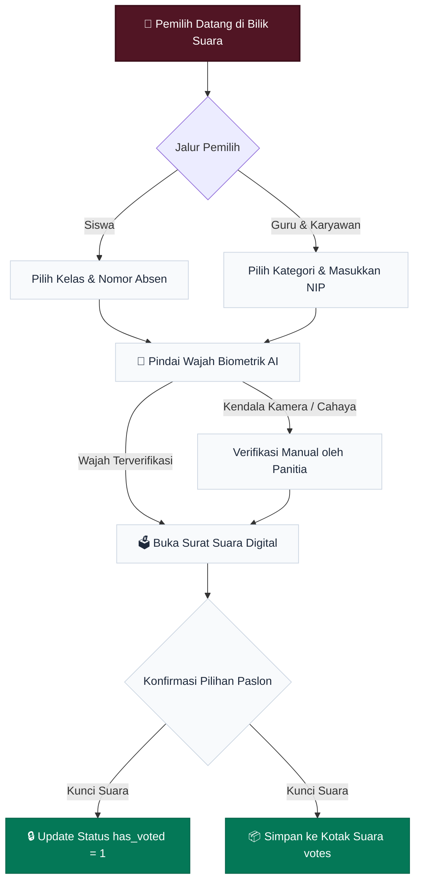

<p align="center">
  
</p>

<h1 align="center">🗳️ E-Pilketos v2.0</h1>

<p align="center">
  <b>Sistem Pemilihan Ketua OSIS Digital Berbasis Biometrik Wajah & Secret Ballot</b><br>
  <i>SMKS Semen Gresik — Yayasan Semen Indonesia</i>
</p>

<p align="center">
  <a href="https://php.net"></a>
  <a href="https://mariadb.org"></a>
  <a href="https://github.com/justadudewhohacks/face-api.js"></a>
  <a href="#-fitur-pwa--kiosk"></a>
  <a href="LICENSE"></a>
</p>

<p align="center">
  <a href="#-komparasi-sistem">⚖️ Komparasi</a> •
  <a href="#-fitur-unggulan">✨ Fitur</a> •
  <a href="#-diagram-alur-sistem">📊 Diagram Alur</a> •
  <a href="#-bedah-teknis--arsitektur">🔍 Bedah Teknis</a> •
  <a href="#-tech-stack">🛠️ Tech Stack</a> •
  <a href="#-panduan-instalasi-cepat">🚀 Instalasi</a> •
  <a href="LICENSE">📄 Lisensi</a>
</p>

---

## 📌 Sekilas Proyek

**E-Pilketos v2.0** adalah platform *e-voting* modern yang dirancang khusus untuk memenuhi standar demokrasi pemilihan ketua OSIS di **SMK Semen Gresik**. Menggabungkan kemudahan surat suara digital di smartphone/tablet dengan verifikasi biometrik pengenalan wajah (*face recognition*) dan penjaminan asas kerahasiaan suara mutlak (*secret ballot*).

---

## ⚖️ Komparasi Sistem

| Parameter | 📋 Pemilihan Kertas Konvensional | 🗳️ E-Pilketos v2.0 (Modern) |
| :--- | :--- | :--- |
| **Verifikasi Pemilih** | Tanda tangan di lembar presensi fisik | **AI Face Recognition biometrik real-time (< 1 detik)** |
| **Waktu Rekapitulasi** | 3 – 5 Jam (hitung manual di aula) | **Otomatis & Real-Time (0 detik setelah bilik ditutup)** |
| **Biaya Logistik** | Jutaan rupiah (cetak surat suara, tinta, bilik) | **Rp 0,- (100% Paperless & ramah lingkungan)** |
| **Kerahasiaan Suara** | Rawan terlihat saat kertas dilipat/dicoblos | **Tabel suara terpisah tanpa ID pemilih (*Zero-Trace*)** |
| **Dukungan Perangkat** | Fisik kertas di bilik kayu/kardus | **PWA Standalone (Tablet Kiosk, HP, & Laptop)** |
| **Berita Acara** | Ditulis tangan, rawan selisih angka | **Auto-Generated format dinas resmi siap cetak/PDF** |

---

## ✨ Fitur Unggulan

- **📱 Progressive Web App (PWA) & Tablet Kiosk:** Mendukung mode *standalone* tanpa bar URL browser. Panitia bilik suara dapat memasang aplikasi di layar utama Tablet dengan 1 kali klik.
- **📸 Biometrik Wajah Client-Side:** Verifikasi wajah pemilih diproses langsung di peramban menggunakan `face-api.js` (MobileNet SSD + ResNet-34). Ringan, tanpa GPU server, dan tanpa mengirim foto mentah ke cloud.
- **🔒 Kerahasiaan Suara Mutlak (*True Secret Ballot*):** Tabel kotak suara (`votes`) dirancang steril dari relasi ID pemilih (`student_id` / `employee_id`), menjamin suara tidak dapat dilacak oleh siapapun.
- **👥 DPT Terpadu (Siswa, Guru & Karyawan):** Mengakomodasi 18 rombel kelas siswa (X, XI, XII dari jurusan RPL, TOI, TKRO, TP, KI) serta guru dan staf kependidikan.
- **📊 Quick Count & Berita Acara Dinas Otomatis:** Perolehan suara dihitung otomatis dan dapat langsung dicetak menjadi Berita Acara resmi lengkap dengan kolom tanda tangan Kepala Sekolah & Panitia.
- **⚡ Zero-Build, Pure Native:** Ditulis dengan Native PHP 8.1+ & Vanilla JavaScript. Super ringan, tanpa *node_modules*, dan siap jalan di server intranet maupun *shared hosting*.

---

## 📊 Diagram Alur Sistem

Alur pemilihan terintegrasi yang dirender langsung secara native:



---

## 🔍 Bedah Teknis & Arsitektur

<details>
<summary><b>🔒 1. Protokol Keamanan: Kenapa Suara Mustahil Dilacak? (Secret Ballot)</b></summary>
<br>

Berbeda dengan sistem *e-voting* biasa yang menyimpan `user_id` pada setiap suara masuk, E-Pilketos v2.0 memisahkan hak klaim dan surat suara menjadi dua proses yang independen (*blind voting*):

1. **Pencatatan Kehadiran:** Saat pemilih mencoblos, sistem menandai kolom `has_voted = 1` pada tabel `students` atau `employees`. Ini memastikan 1 orang hanya bisa memilih 1 kali.
2. **Penyimpanan Suara:** Kertas suara digital disimpan ke tabel `votes` yang **hanya berisi `candidate_id` dan `created_at`**, tanpa menyimpan kolom ID pemilih sama sekali.
3. **Pemisahan Transaksi:** Bahkan jika administrator membuka database secara langsung, mustahil menghubungkan suara tertentu dengan pemilih tertentu.
</details>

<details>
<summary><b>📸 2. Spesifikasi Pipeline AI Biometrik (face-api.js)</b></summary>
<br>

- **Deteksi Wajah:** *Tiny Face Detector* berbasis MobileNetV1-SSD, dioptimalkan untuk perangkat mobile dengan konsumsi memori rendah.
- **Penyelarasan Landmark:** *68-point Facial Landmark Predictor* untuk mendeteksi posisi mata, hidung, dan kontur wajah.
- **Ekstraksi Fitur:** *ResNet-34 Architecture* yang memetakan karakteristik wajah ke dalam vektor matematis 128-dimensi (*descriptor*).
- **Pencocokan Euclidean:** Membandingkan vektor wajah pemilih saat ini dengan data pra-registrasi menggunakan *Euclidean Distance* dengan nilai ambang batas (*threshold*) yang dapat dikalibrasi (default: 0.50).
</details>

<details>
<summary><b>📲 3. Cara Pasang Mode Kiosk di Tablet Sekolah (PWA)</b></summary>
<br>

1. Buka browser (Google Chrome atau Microsoft Edge) di Tablet bilik suara.
2. Akses alamat web pemilihan, misal: `http://192.168.1.100:8080/`
3. Klik tombol **"Pasang Aplikasi"** di bagian atas halaman atau pada banner yang muncul di bawah layar.
4. Aplikasi akan otomatis terpasang di layar utama (*Home Screen*) tablet.
5. Saat dibuka, aplikasi akan berjalan **layar penuh (full-screen)** tanpa bilah alamat URL browser, siap digunakan sebagai bilik suara resmi!
</details>

---

## 🛠️ Tech Stack

| Lapisan Sistem | Teknologi | Rationale / Kegunaan |
| :--- | :--- | :--- |
| **Backend** | Native PHP 8.1+ | Prepared Statements (PDO), arsitektur modular, atomic transactions |
| **Database** | MariaDB 10.x / MySQL 8.x | Relasi foreign key, transaksi ACID, dukungan `.env` |
| **PWA & Cache** | Service Worker (`sw.js`) & Manifest | Cache-First untuk aset statis/AI, Network-First untuk kotak suara |
| **Biometrik AI** | face-api.js (TensorFlow.js) | Tiny Face Detector + 68 Landmarks + ResNet-34 Descriptors |
| **Frontend** | HTML5, CSS3, Vanilla JS | Desain *mobile-first* dengan tema warna resmi SMK SIG (Deep Maroon) |
| **Keamanan** | Bcrypt & Anti-CSRF | Hashing password standar industri & token proteksi sesi |

---

## 🚀 Panduan Instalasi Cepat

### 1. Klon Repositori
```bash
git clone https://github.com/Nozella-Alexiee/e-pilketos.git
cd e-pilketos
```

### 2. Konfigurasi Database
Salin berkas template environment:
```bash
cp .env.example .env
```
Buka file `.env` dan atur koneksi database MySQL lokalmu:
```ini
DB_HOST=127.0.0.1
DB_NAME=epilketos_sig
DB_USER=root
DB_PASS=
```
Import skema dan data awal resmi:
```bash
mysql -u root -p epilketos_sig < database.sql
```

### 3. Jalankan Web Server
```bash
php -S 0.0.0.0:8080
```

Akses portal melalui peramban:
* 🗳️ **Portal Bilik Suara:** [http://localhost:8080/](http://localhost:8080/)
* 📸 **Bilik Suara Wajah (Face POC):** [http://localhost:8080/face-poc/](http://localhost:8080/face-poc/)
* 📊 **Rekapitulasi Suara Publik:** [http://localhost:8080/results.php](http://localhost:8080/results.php)
* ⚙️ **Panel Administrator:** [http://localhost:8080/admin/login.php](http://localhost:8080/admin/login.php)

---

## 📁 Struktur Berkas Proyek

```text
e-pilketos/
├── admin/                     # Modul panel kontrol administrator & panitia
├── assets/                    # Identitas visual, CSS tema SMK SIG, & ikon PWA
│   ├── css/style.css          # Desain sistem & responsivitas tablet/mobile
│   ├── images/icons/          # Paket ikon PWA (192px, 512px, maskable, apple)
│   └── js/pwa.js              # Service Worker manager & PWA install handler
├── config/                    # Koneksi PDO, migrasi skema, & fungsi keamanan
├── face-poc/                  # Modul biometrik wajah mandiri (kamera & AI)
│   ├── assets/models/         # Bobot neural network face-api.js
│   ├── enroll.php             # Registrasi/perekaman vektor wajah siswa & guru
│   └── index.php              # Bilik suara berbasis pengenalan wajah
├── templates/                 # Header & footer standar antarmuka
├── .env.example               # Cetak biru variabel lingkungan
├── database.sql               # Skema basis data resmi (clean slate)
├── manifest.json              # Web App Manifest PWA resmi
├── sw.js                      # Service Worker caching & offline shell
├── offline.html               # Halaman fallback saat koneksi terputus
├── index.php                  # Halaman gerbang utama pemilihan
└── vote.php                   # Alur bilik suara digital
```

---

## 📄 Lisensi & Hak Cipta

Didesain dan dikembangkan dengan dedikasi untuk kemajuan teknologi dan demokrasi di lingkungan **SMKS Semen Gresik**.

Didistribusikan secara bebas dan terbuka di bawah lisensi resmi [MIT License](LICENSE).
